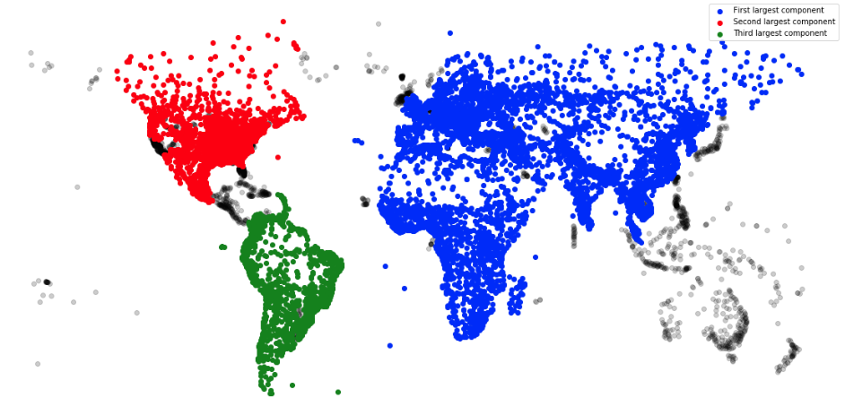

# Large scale Machine Learning techniques
Compilation of practical works using techniques to deal with large scale machine learning problems.

---
## 1. [Random projections](./random_projections/random_projections.ipynb)
*Assignment for Robert Gower's course at Telecom Paris*.

## 2. [KD Trees implementation for KNN](./KD_tree_for_KNN/KD_tree_for_KNN.ipynb)
*Assignment for Thomas Bonald's course at Telecom Paris*

## 3. [Avazu-CTR-prediction-contest](./avazu_CTR_prediction_contest/avazu_prediction_contest.ipynb)
*Assignment for Pascal Bianchi's course at Telecom Paris*

>https://www.kaggle.com/c/avazu-ctr-prediction/overview  
>In online advertising, click-through rate (CTR) is a very important metric for evaluating ad performance. As a result, click prediction >systems are essential and widely used for sponsored search and real-time bidding. The goal is to build and test prediction models on 11 >days of Avazu data.

## 4. [Sketching and MiniHash](./sketching/lab_sketching.ipynb)
*Assignment for Thomas Bonald's course at Telecom Paris*
