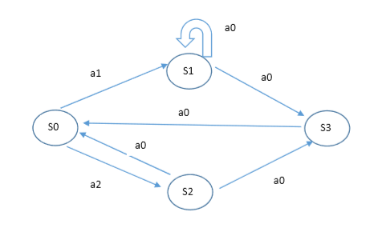
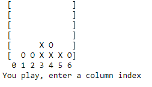
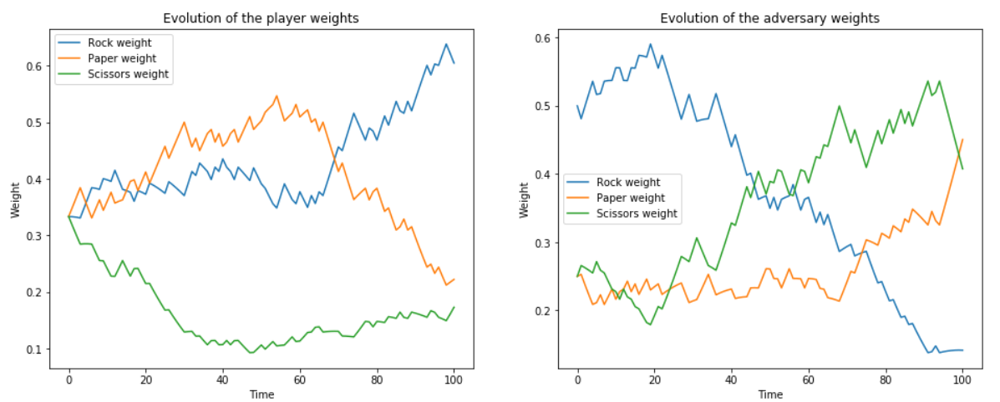
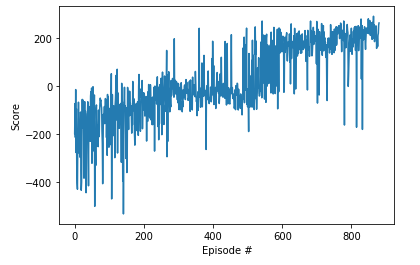

# Reinforcement Learning practical work
*Compilation of work and assignments with my solutions for reinforcement learning thematic.*

* **Dynamic Programming**  
Using dynamic programming methods (Policy Evaluation, Policy Improvement, Policy Iteration, Value Iteration...) to solve reinforcement learning problem in MDP context.  
  
* **Monte Carlo methods**  
Monte Carlo methods for reinforcement learning. The agent learns directly from episodes of experience without any prior knowledge of MDP transitions.
  
* **Bandits Strategies**  
Multi armed bandits problem. An agent chooses an action and each action returns a reward according to a given underlying probability distribution.
  
* **Value Based Methods**  
  
* **Policy Based Methods**  
---  
# Dynamic Programming

#### [Value iteration algorithm implementation](./value_iteration_algorithm/value_iteration_algorithm.ipynb) for MDP graph:

#### [Dynamic programming with OpenAI Gym](./openai_gym/dynamic_programming/Dynamic_Programming.ipynb)
Implementation of Dynamic Programming algorithms such as Policy Evaluation, Policy Improvement, Policy Iteration, and Value Iteration in OpenAI **[Frozen Lake](https://gym.openai.com/envs/FrozenLake-v0)** environment.

# Monte Carlo methods

#### [Monte Carlo Tree Search](./monte_carlo_tree_search/MCTS%20--%20Connect%204-Lab2-newLab.ipynb)
*Performing monte carlo tree search for the game connect 4, by Claire Vernade.*  
  
  
  
#### [Monte Carlo methods with OpenAI Gym](./openai_gym/monte-carlo-methods/Monte_Carlo.ipynb)
Implementation of Monte Carlo methods for prediction and control in **[Black Jack environment](https://github.com/openai/gym/blob/master/gym/envs/toy_text/blackjack.py)**

# Bandits strategies
*Work done during the course of Thomas Bonald and Pierre Gaillard at Telecom Paris.*

Implementation and test of the performance of some usual bandit algorithms.

* **𝜀 -greedy**
* **adaptive greedy**
* **UCB**
* **Thompson sampling**

#### [Bandits algorithms](./bandits_strategies/stochastic-bandits/bandits_algorithms.ipynb)
Implementation of the above algorithms in a bandit environment (Bernouilli and Gaussian rewards).

#### [Stochastic bandits](./bandits_strategies/stochastic-bandits/lab-stochastic-bandits.ipynb)
Look at the regret and precision of these algorithms, with some statistics.

#### [Adversarial bandits](./bandits_strategies/adversarial-bandits/Adversarial_bandits.ipynb)
Implementation of EXP3 algorithm for simple player vs adversary game.

# Value Based Methods

#### [Deep Q Network Agent with OpenAI Gym](./openai_gym/deep-q-network)
  
Deep Q-learning algorithm implementation in the OpenAI's [Lunar Lander](https://gym.openai.com/envs/LunarLander-v2) gym environment *(see [this paper](https://web.stanford.edu/class/psych209/Readings/MnihEtAlHassibis15NatureControlDeepRL.pdf) for DQN details)*.  
  
Learning visualization:  
  
  
Results:  
  
