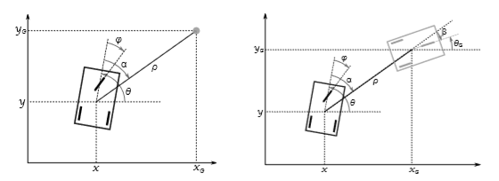
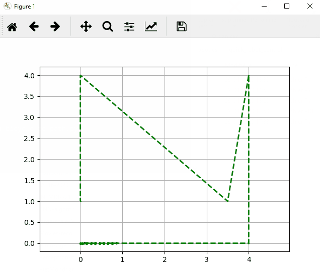
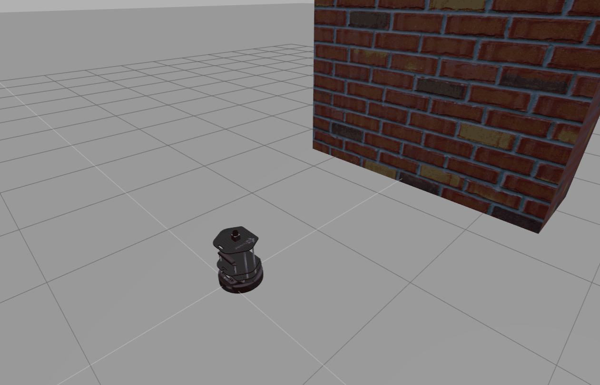
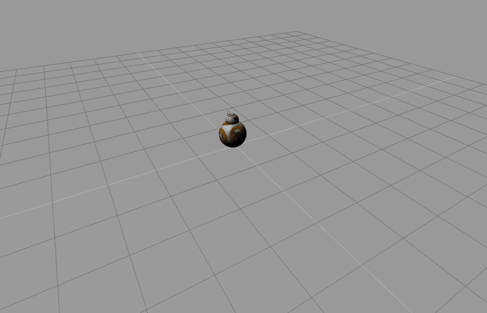
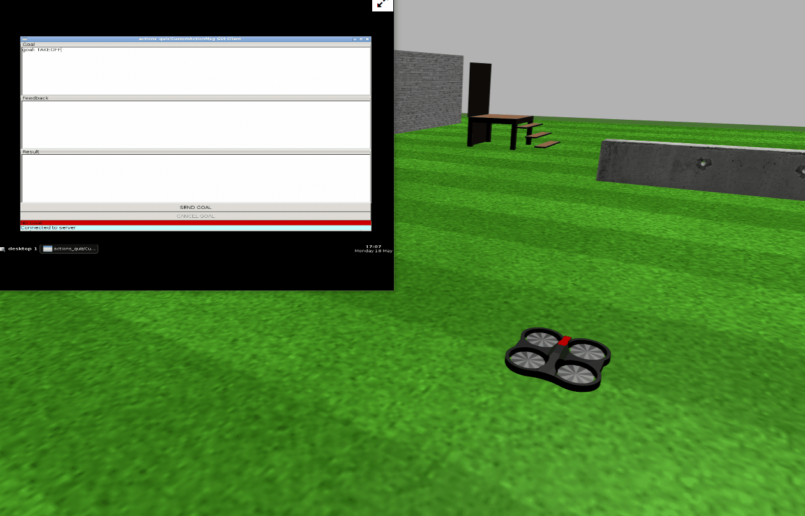

# Some Robotics

## 1. Control of unicycle and bicycle robots (by David Filliat)

My implementations of very simple control methods, based on PID controller, for the control of unicycle and bicycle robots.
  

  

  
**Bicycle following a path:**  
  

  

  
  
## 2. ROS Exercices

My solutions to several exercices of the course "*ROS in 5 Days*" from the [robot ignite learning platform](https://www.robotigniteacademy.com)

### Topics
  
Using *Topics* to make a robot avoid walls.  
  

  
### Services
  
Using *Services* to make a BB8 robot move in square.  
  

  
### Actions
  
Using *Actions* to control "Taking off" and "Landin" commands of a drone.  
  

