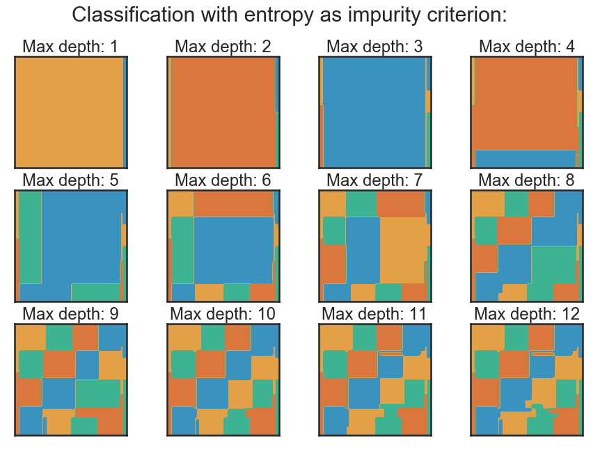

# Statistical learning practical work
Compilation of some practical work about statistical learning.  
*Work done for Pavlo Mozharovskyi course at Telecom Paris*

* Decision tree classifiers
* KNN algorithm implementation
* Linear regression from scratch
* Movies recommendation
* Perceptron stochastic gradient descent visualisation
* Time series
* Nonnegative matrix factorization

---

# [Decision tree classifiers](./decision-tree-classifiers)
Playing with decision tree classifiers: classifications on 2D generated data set, classification on sklearn "Digits" data set.

---

# [KNN algorithm implementation](./knn-algorithm-implementation)
Simple implementation of the K-NN working with two datasets.

* [breast-cancer-wisconsin.data](https://archive.ics.uci.edu/ml/machine-learning-databases/breast-cancer-wisconsin/breast-cancer-wisconsin.data)
* [haberman.data](https://archive.ics.uci.edu/ml/machine-learning-databases/haberman/haberman.data)

KNN function should work with any dataFrame with numerical values and the class label to predict in the last column, as long as there is no NaN value.

The loadAndSplitDataSet, as well as the plot functions, are specific for the two mentionned above data sets: they aim to clean the data and represent the obtained results.

---

# [Linear regression from scratch](./linear-regression)
Retrieving from scratch some basic linear regression elements with a simple data set.

### Uni-dimensional regression:  

### Two-dimensional regression:  

---

# [Movies recommendation](./movies-recommendation)
Machine learning methodology example for a movie recommendation problem.

---

# [Perceptron stochastic gradient descent visualisation](./perceptron-stochastic-gradient-descent-visu)
Quick visualization of a stochastic gradient descent for a perceptron.

---

# [Time series](./time-series)

Compilation of some work about time series prediction and auto regression model.

Data sets:

* Flu symptome data: http://www.openhealth.fr/ias
 
 * Internet traffic data: ftp://ita.ee.lbl.gov/html/contrib/LBL-TCP-3.html
 
 * Southern oscillation index data: http://www.bom.gov.au/climate/glossary/soi.shtml
 
 ---
 # [Nonnegative matrix factorization](./nonnegative-matrix-factorization)

*Work done during Slim Essid course at Telecom Paris.*

* NMF and PCA comparison
* Performing topic extraction with NMF
